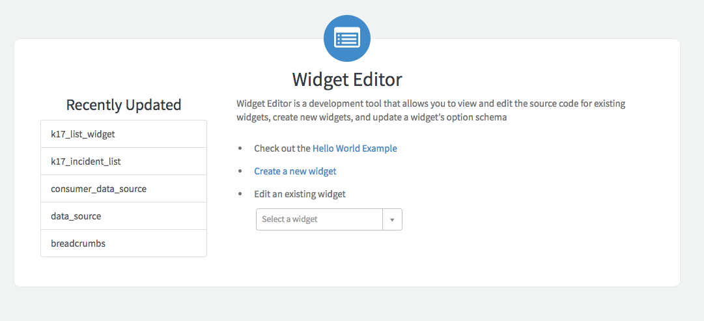
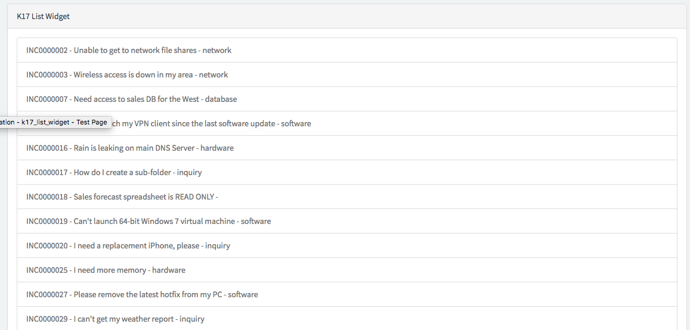

Lab Guide

CCW4231:

Advance Service Portal Widget techniques

Martin Palacios

Lab instance: http://clabs.link/ccw4231

Default Login / Password:

admin / Knowledge17

itil / Knowledge17

employee / Knowledge17

This

Page

Intentionally

Left

Blank

Lab Goal

In this lab we will create a list widget and then we will modify it to
load data client side.

Log on to Your Training Instance.
=================================

1.  Navigate to the unique instance URL provided to you.

2.  Log on with provided credentials. Include periods at the end of your
    steps. Exclude the period if a step ends with text the student needs
    to copy and paste to prevent the period from being grabbed
    accidentally.

 Create List Widget
===================

1.  Navigate to Service Portal \> Service Portal Configuration.

2.  Select **Widget Editor**

3.  Select **Create a new widget**\
    \
    {width="4.68125in"
    height="2.1350699912510938in"}

4.  Enter the following information:

-   Widget Name: k17\_list\_widget

-   Widget ID: k17\_list\_widget

-   Create Test Page: checked

-   Page Id: k17\_list\_widget

5.  Click the **Submit** button.

6.  Your Screen should look like this\
    \
    {width="5.68125in"
    height="1.3656846019247595in"}

Enter Widget Information
========================

1.  Enter the following information in the Server Script Window:

(function () {

/\* populate the \'data\' object \*/

/\* e.g., data.table = \$sp.getValue(\'table\'); \*/

//define the variable to hold our list

data.list = \[\];

//Query the table

var gr = new GlideRecord(\'incident\');

gr.addQuery(\'active\', true);

gr.query()

while (gr.next()) {

//load values into object

var record\_obj = {};

record\_obj.number = gr.number.getDisplayValue();

record\_obj.short\_description =
gr.short\_description.getDisplayValue();

record\_obj.priority = gr.priority.getDisplayValue();

record\_obj.category = gr.category.getDisplayValue();

//add object to the list

data.list.push(record\_obj);

}

})();

2.  Enter the following information in the HTML template box

\

\<!\-- your widget template \--\>

\

K17 List Widget

\</div\>

\

\<ul class=\"list-group\"\>

\<li class=\"list-group-item\" ng-repeat=\"item in
c.data.list\"\>{{item.number}} - {{item.short\_description}} -
{{item.priority}}\</li\>

\</ul\>

\</div\>

\</div\>

3.  Click **Save**

4.  Navigate to \[your instance\]
    .service-now.com/sp\_config/?id=k17\_list\_widget and check your
    results\
    \
    {width="6.5in" height="4.7131944444444445in"}

Load data client side
=====================

1.  Navigate back to the widget editor

2.  Modify the Server Script to look like this

(function() {

/\* populate the \'data\' object \*/

/\* e.g., data.table = \$sp.getValue(\'table\'); \*/

**if(input){**

//define the variable to hold our list

data.list = \[\];

//Query the table

var gr = new GlideRecord(\'incident\');

gr.addQuery(\'active\', true);

gr.query()

while (gr.next()) {

//load values into object

var record\_obj = {};

record\_obj.number = gr.number.getDisplayValue();

record\_obj.short\_description =
gr.short\_description.getDisplayValue();

record\_obj.priority = gr.priority.getDisplayValue();

record\_obj.category = gr.category.getDisplayValue();

//add object to the list

data.list.push(record\_obj);

}

**}**

})();

1.  Enter the following information in the Client Script

function(\$scope) {

/\* widget controller \*/

var c = this;

c.data.loading = true;

\$scope.server.update().then(function(){

c.data.loading = false;

})

}

2.  Modify the html template to look like this

\

\<!\-- your widget template \--\>

\

K17 List Widget

\</div\>

\

\\<i class=\"fa fa-spinner fa-spin fa-3x
fa-fw\"\>\</i\>

\Loading\...\</span\>\</span\>

\<ul class=\"list-group\"\>

\<li class=\"list-group-item\" ng-repeat=\"item in
c.data.list\"\>{{item.number}} - {{item.short\_description}} -
{{item.priority}}\</li\>

\</ul\>

\</div\>

\</div\>

3.  Click **Save\
    **

4.  Navigate to \[your instance\]
    .service-now.com/sp\_config/?id=k17\_list\_widget and check your
    results

Progress Report 
================

1.  Navigate to Lab Management\> Report Lab Progress.\
    \
    {width="3.3048611111111112in"
    height="1.2881944444444444in"}

<!-- -->

5.  Click I am done!\
    \
    {width="6.5in"
    height="1.086142825896763in"}

Lab Goal

In this lab we will modify our list widget to make use of the REST API.

Modify List Widget.
===================

1.  Navigate to the widget editor and open the k17\_list\_widget.

<!-- -->

6.  Modify the Server Script to look like this

(function() {

/\* populate the \'data\' object \*/

/\* e.g., data.table = \$sp.getValue(\'table\'); \*/

})();

7.  Modify the Client Script to look like this:

function(\$scope,\$http) {

/\* widget controller \*/

var c = this;

c.data.loading = true;

\$http.get(\'/api/now/table/incident?sysparm\_query=active%3Dtrue\').success(function(response){

c.data.loading=false;

c.data.list = response.result;

})

}

8.  Click **Save**

9.  Navigate to \[your instance\]
    .service-now.com/sp\_config/?id=k17\_list\_widget and check your
    results

Progress Report
===============

1.  Navigate to **Lab Management\> Report Lab Progress**.\
    \
    {width="3.3048611111111112in"
    height="1.2881944444444444in"}

<!-- -->

10. Click I am done!\
    \
    {width="6.5in"
    height="1.086142825896763in"}

Lab Goal

In this lab we create 2 ng templates to be used by our widgets

Create Templates.
=================

1.  Navigate to Service Portal \> Widgets

<!-- -->

11. Open the k17\_list\_widget.

12. Scroll to the bottom and select the Angular **ng-templates tab\
    **

13. Click **New\
    **

14. Enter the following information

-   ID: task-priority

-   Template:

\<span\>{{item.number}} - {{item.short\_description}} -
{{item.priority}}\</span\>

15. Click Submit

16. Scroll to the bottom and select the Angular **ng-templates tab\
    **

17. Click **New**

18. Enter the following information

-   ID: task-category

-   Template:

\<span\>{{item.number}} - {{item.short\_description}} -
{{item.category}}\</span\>

19. Click **Submit**

Update List widget
==================

1.  Open the k17\_list\_widget using the widget editor

<!-- -->

20. Modify the HTML template to look like this

\

\<!\-- your widget template \--\>

\

K17 List Widget

\</div\>

\

\\<i class=\"fa fa-spinner fa-spin fa-3x
fa-fw\"\>\</i\>

\Loading\...\</span\>\</span\>

\<ul class=\"list-group\"\>

\<li class=\"list-group-item\" ng-repeat=\"item in c.data.list\"
ng-include=\"\'task-category\'\"\>\</li\>

\</ul\>

\</div\>

\</div\>

21. Click **Save\
    **

22. Navigate to \[your instance\]
    .service-now.com/sp\_config/?id=k17\_list\_widget and check your
    results\
    \
    {width="6.5in" height="3.1125in"}

Progress Report
===============

1.  Navigate to **Lab Management\> Report Lab Progress**.\
    \
    {width="3.3048611111111112in"
    height="1.2881944444444444in"}

<!-- -->

1.  Click I am done!\
    \
    {width="6.5in"
    height="1.086142825896763in"}

Lab Goal

In this lab we will define options for our widget

Add out of box options
======================

1.  Navigate to Service Portal \> Widgets

<!-- -->

23. Open the k17\_list\_widget.

24. Click on the lock icon next the **Fields** field

25. Add the following fields:

-   Title

-   Bootstrap Color

26. Click **Update**

Modify list widget
==================

1.  Open the k17\_list\_widget using the widget editor.\
    NOTE: If you had the editor open, refresh it before continuing.

<!-- -->

27. Click on the {width="0.3513779527559055in"
    height="0.3685181539807524in"} icon in the top right corner

28. Select Edit Option Schema

29. Click on the {width="0.28189304461942255in"
    height="0.2537040682414698in"} icon in the top right corner on of
    the modal window\
    \
    \
    {width="4.42215769903762in"
    height="2.5814818460192477in"}

30. Enter the following information

-   Label: Table

-   Name: table

-   Type: String

-   Default Value: incident

31. Click on the {width="0.28189304461942255in"
    height="0.2537040682414698in"} icon in the top right corner on of
    the modal window

32. Enter the following information

-   Label: Query

-   Name: query

-   Type:string

-   Default Value: leave empty

33. Click on the {width="0.28189304461942255in"
    height="0.2537040682414698in"} icon in the top right corner on of
    the modal window

34. Enter the following information

-   Label: Template

-   Name: template

-   Type:string

-   Default Value: leave empty

35. Click **Save\
    **

36. Modify Client Script to look like this

function(\$scope,\$http) {

/\* widget controller \*/

var c = this;

c.data.loading = true;

c.data.table = c.options.table \|\| \"incident\";

c.data.query = c.options.query \|\| \"\";

c.data.template = c.options.template \|\| \"task-category\";

\$http.get(\'/api/now/table/\'+c.data.table+\'?sysparm\_query=\'+c.data.query).success(function(response){

c.data.loading=false;

c.data.list = response.result;

})

}

37. Modify HTML Template to look like this

\

\<!\-- your widget template \--\>

\

{{c.options.title}}

\</div\>

\

\\<i class=\"fa fa-spinner fa-spin fa-3x
fa-fw\"\>\</i\>

\Loading\...\</span\>\</span\>

\<ul class=\"list-group\"\>

\<li class=\"list-group-item\" ng-repeat=\"item in c.data.list\"
ng-include=\"c.data.template\"\>\</li\>

\</ul\>

\</div\>

\</div\>

38. Click **Save\
    **

39. Navigate to \[your instance\]
    .service-now.com/sp\_config/?id=k17\_list\_widget

40. Press **"Control" right click** on top of your widget

41. Select Instance Options\
    \
    {width="1.3285290901137359in"
    height="1.8018514873140858in"}

42. Enter the following information\
    \
    {width="4.677281277340333in"
    height="2.6064851268591425in"}

43. Click **Save**

44. Check your results\
    \
    {width="6.5in" height="2.225in"}

Progress Report
===============

1.  Navigate to **Lab Management\> Report Lab Progress**.\
    \
    {width="3.3048611111111112in"
    height="1.2881944444444444in"}

<!-- -->

45. Click I am done!\
    \
    {width="6.5in"
    height="1.086142825896763in"}

Lab Goal

In this lab we will create a record watcher so our widget is
automatically updated without having to refresh the page

Set up record watcher
=====================

1.  Open the k17\_list\_widget using the widget editor.

<!-- -->

46. Modify the Client Script to look like this:

function(\$scope,\$http,snRecordWatcher) {

/\* widget controller \*/

var c = this;

c.data.loading = true;

c.data.table = c.options.table \|\| \"incident\";

c.data.query = c.options.query \|\| \"\";

c.data.template = c.options.template \|\| \"task-category\";

function getData(){

\$http.get(\'/api/now/table/\'+c.data.table+\'?sysparm\_query=\'+c.data.query).success(function(response){

c.data.loading=false;

c.data.list = response.result;

})

}

getData();

snRecordWatcher.initList(c.data.table, c.data.query);

\$scope.\$on(\'record.updated\', function(name, data) {

getData();

});

}

47. Click **Save**

48. Navigate to \[your instance\]
    .service-now.com/sp\_config/?id=k17\_list\_widget

49. How Many Changes are displayed?

50. Open a new window and open a new critical priority change request.

51. Go back to your widget window, is the new change request now
    showing?

Progress Report
===============

1.  Navigate to **Lab Management\> Report Lab Progress**.\
    \
    {width="3.3048611111111112in"
    height="1.2881944444444444in"}

<!-- -->

52. Click I am done!\
    \
    {width="6.5in"
    height="1.086142825896763in"}

Lab Goal

In this lab we will modify our widget to boradcast an event and have
another widget receive that event.

Set up event
============

1.  Open the k17\_list\_widget using the widget editor.

<!-- -->

53. Modify the Client Script to look like this:

function(\$scope,\$http,snRecordWatcher,\$rootScope) {

/\* widget controller \*/

var c = this;

c.data.loading = true;

c.data.table = c.options.table \|\| \"incident\";

c.data.query = c.options.query \|\| \"\";

c.data.template = c.options.template \|\| \"task-category\";

function getData(){

\$http.get(\'/api/now/table/\'+c.data.table+\'?sysparm\_query=\'+c.data.query).success(function(response){

c.data.loading=false;

c.data.list = response.result;

**\$rootScope.\$broadcast(\"K17ListWidgetUpdated\",c.data.list);**

})

}

getData();

snRecordWatcher.initList(c.data.table, c.data.query);

\$scope.\$on(\'record.updated\', function(name, data) {

getData();

});

}

54. Click **Save\
    **

55. Click {width="0.29632983377077865in"
    height="0.2600437445319335in"}

56. Select Create New Widget

57. Enter the following information:

-   Widget Name: k17\_count\_display\_widget

-   Widget ID: k17\_count\_display\_widget

58. Click Submit

59. Enter the following code in the HTML Template Field:

\<div\>

\<!\-- your widget template \--\>

\<h2 class=\"jumbotron\"\>

Total Records:{{c.data.count}}

\</h2\>

\</div\>

60. Enter the following code in the Client Script field:

function(\$scope) {

/\* widget controller \*/

var c = this;

c.data.count = 0;

\$scope.\$on(\"K17ListWidgetUpdated\",function(evt,results){

console.log(results)

c.data.count = results.length;

})

}

61. Click **Save**

62. Click on the **Designer** Option in widget header menu\
    \
    {width="6.5in" height="1.63125in"}

63. Use the filter to look for k17\_list\_widget Test Page

64. Select the Page

65. Use the filter to search for k17\_count\_display\_widget\
    \
    {width="2.342623578302712in"
    height="2.5785717410323707in"}

66. Drag and drop k17\_count\_display\_widget above the k17 List Widget

67. Navigate to \[your instance\]
    .service-now.com/sp\_config/?id=k17\_list\_widget

68. Is the count of records populating?

Progress Report
===============

1.  Navigate to **Lab Management\> Report Lab Progress**.\
    \
    {width="3.3048611111111112in"
    height="1.2881944444444444in"}

<!-- -->

2.  Click I am done!\
    \
    {width="6.5in"
    height="1.086142825896763in"}
